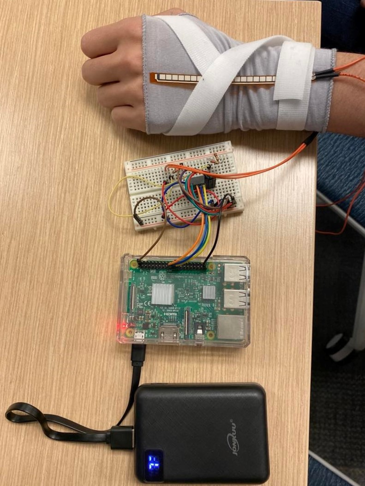

# **Bubba-Band**

## **Installation**

The backend is written with Python 3 using the Flask web framework. To install
dependencies, first create and activate a virtual environment.
```
python3 -m venv env
source env/bin/activate
```
Then install the dependencies in `requirements.txt`
```
pip install -r backend/requirements.txt
```

The frontend is written with Node. To install dependencies, navigate into the
`frontend/` folder and run `yarn` or `npm` to install the node dependencies.

```
cd frontend/
yarn install
```
or
```
cd frontend/
npm install
```

## **Running the application**

The backend is hosted on http://ec2-3-17-64-150.us-east-2.compute.amazonaws.com/ so the armband is completely wireless.

### **Frontend Setup**

To run the frontend, run the following in  new terminal (depending on `yarn` or `npm`):
```
cd frontend/
yarn start
```
or
```
cd frontend/
npm start
```

### **Hardware Setup**

This project was implemented and tested with our armband hardware (Raspberry Pi, pressure sensor, circuit), but if you don't have the hardware, you can run our Pi emulator to explore the UI. However, since this isn't what we originally built the application for, the results may vary.

#### **Armband Setup**
The breadboard and Pi should be prewired.

1. Hook the portable battery up to the Pi using the micro-USB port
2. Slip the armband onto your wrist
3. Put your wrist in between the two wires leading up to the sensor so that one wire is to the left of your wrist and one wire is to the right of your wrist and so that the sensor is touching the back of your hand with the squares facing away from your wrist
4. Secure the bottom of the sensor (by the wires) with a velcro strip around your wrist 
5. Hold the sensor against the back of your hand and use the velcro to secure both the base of the sensor (by the wires) and the tip of the sensor

Using these steps, your hardware setup should look like the following:



On the Pi, open a terminal and navigate to the `Bubba-Band` folder, then from there, run the Raspberry Pi file `main.py`:

```
python3 hardware/main.py
```

This will start the sensor on the Raspberry Pi. To send signals and test it out, tap or hold your wrist according to Bubba's gestures:

- 1 hard tap = Yes
- 2 hard taps = Hi
- 5+ hard taps = Happy
- Holding wrist down = Need help
- 1 soft tap = Maybe

#### **Raspberry Pi Emulator**

If you don't have the armband and Raspberry Pi to test the application, you can use the Pi emulator to emulate the Pi (instructions below). If you don't want to use that, you can go into the frontend code and comment out the test buttons, but results may vary.

You can run the Raspberry Pi emulator file `fakePi/fakePi.py` to mimic its signals.

In the root directory:
```
python3 backend/fakePi/fakePi.py
```

To send a signal to the frontend, you either input a 1 (hard tap), 2 (soft tap) or 3 (holding wrist down) in the terminal.

- 1 hard tap = Yes
- 2 hard taps = Hi
- 5+ hard taps = Happy
- Holding wrist down = Need help
- 1 soft tap = Maybe
