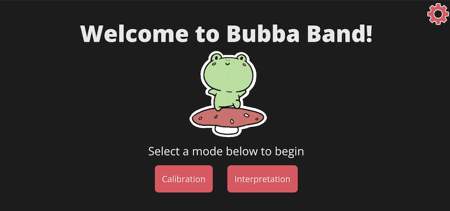
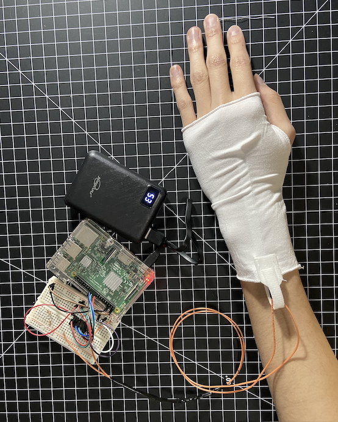

# **Bubba Band**


## **Installation**

The backend is written with Python 3 using the Flask web framework. To install
dependencies, first create and activate a virtual environment.
```
python3 -m venv env
source env/bin/activate
```
Then install the dependencies in `requirements.txt`
```
pip install -r backend/requirements.txt
```

## **Running the application**

The frontend is running on [bubbaband.naitian.org/frontend/](https://bubbaband.naitian.org/frontend/) and the backend is hosted on [bubbaband.naitian.org](bubbaband.naitian.org) so the armband is completely wireless.

### **Frontend**

To run the frontend, go to [bubbaband.naitian.org/frontend/](https://bubbaband.naitian.org/frontend/) (trailing slash needed).

### **Hardware Setup**

This project was implemented and tested with our armband hardware (Raspberry Pi, pressure sensor, circuit), but if you don't have the hardware, you can run our Pi emulator to explore the UI. However, since this isn't what we originally built the application for, the results may vary.

#### **Armband Setup**
The breadboard and Pi should be prewired. Below is a picture of the breadboard setup.

1. Hook the portable battery up to the Pi using the micro-USB port
2. Slip the armband onto your wrist with the pocket on the back of the hand
3. Fasten the bottom of the sensor (by the wires) with a velcro strip around your wrist the velcro strap in between the two sensor wires so that the sensor cannot slip out. There should be one wire on either side of the velcro strap

Using these steps, your hardware setup should look like the following:



On startup of the hardware, it should automatically connect to the Eduroam WiFi and run `main.py`. If you need to configure the WiFi, please contact us or use [this tutorial](https://raspberrypihq.com/how-to-connect-your-raspberry-pi-to-wifi/) to set it up by yourself.

#### **Raspberry Pi Emulator**

If you don't have the armband and Raspberry Pi to test the application, you can use the Pi emulator to emulate the Pi (instructions below). If you don't want to use that, you can go into the frontend code and comment out the test buttons, but results may vary.

You can run the Raspberry Pi emulator file `fakePi/fakePi.py` to mimic its signals.

In the root directory:
```
python3 hardware/fakePi/fakePi.py
```
## **Gesture Mapping**
To send a signal to the frontend, you either input a 1 (hard tap), 2 (soft tap) or 3 (holding wrist down) in the terminal.

- 1 hard tap = Yes
- 1 soft tap = Maybe
- Holding wrist down = Need help
- 2 gestures = Hi
- 5+ gestures = Happy
